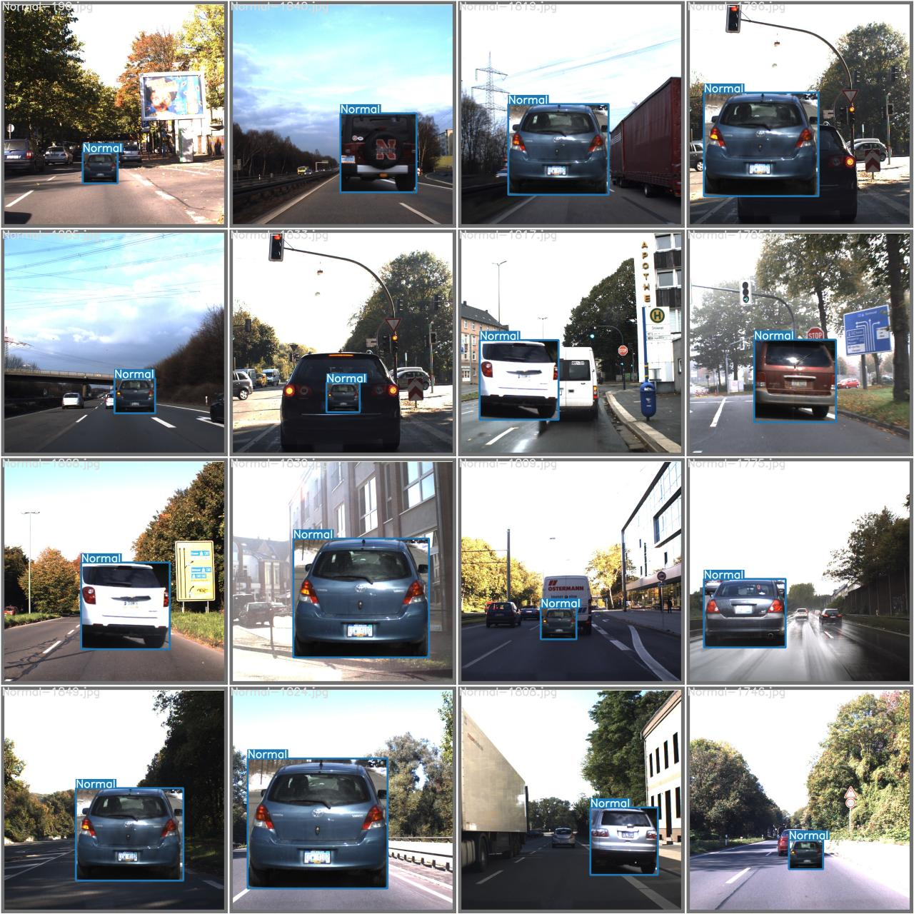

***

# Brake Light Detection using YOLOv7

Real-time vehicle brake light detection system using YOLOv7 for autonomous driving applications.


## Overview

Binary classification system that detects vehicle brake lights as **Braking** or **Normal** status using synthetic dataset generation and YOLOv7 framework.

Developed during internship at **Institute for Information Industry (III)**, Taiwan (2023) for **Autoware Challenge 2023**.

## Demo

### Real-world Inference
Real-time detection on road footage showing the model distinguishing between **Braking** and **Normal** states.


### Synthetic Data Validation
Comparison between Ground Truth (Labels) and Model Predictions on the synthetic test batch.

| Ground Truth (Labels) | Model Prediction |
| :---: | :---: |
|  |  |

## Performance

### Training Metrics
Training results over 20 epochs showing Precision, Recall, and mAP improvements.


- **Training Environment:** Google Colab (T4 GPU)
- **Epochs:** 20 (Optimal for free-tier usage)
- **Model Size:** ~75MB
- **Speed:** Real-time on GPU

## Installation

### Prerequisites

- Python 3.8+
- CUDA-capable GPU (recommended)
- 10GB+ free disk space

### Setup

```bash
# Clone this repository
git clone https://github.com/vi730/brake-light-detection.git
cd brake-light-detection

# Install dependencies
pip install -r requirements.txt

# Clone and setup YOLOv7
git clone https://github.com/WongKinYiu/yolov7.git
cd yolov7
pip install -r requirements.txt

# Download pretrained weights
wget https://github.com/WongKinYiu/yolov7/releases/download/v0.1/yolov7.pt
```

## Dataset Preparation

### Data Sources

**Foreground (Vehicle Rear Crops):**
- [Rear Signal Dataset](http://vllab1.ucmerced.edu/~hhsu22/rear_signal/) by UC Merced
  - Braking: Folders ending with "BOO"
  - Normal: Folders ending with "OOO"
  - Recommended: 400+ images per class

**Background (Road Scenes):**
- [GTSDB](https://benchmark.ini.rub.de/gtsdb_dataset.html) - German Traffic Sign Detection Benchmark

### Organize Data

```
yolov7/
└── data_source/
    ├── Braking/        # BOO folders
    ├── Normal/         # OOO folders
    └── Backgrounds/    # .ppm files
```

### Generate Synthetic Dataset

```bash
cd yolov7
# Execute the script located in the parent directory
python ../create_dataset.py
```

**Configuration:** Edit `IMGS_PER_CLASS` in `create_dataset.py` (default: 500)

This creates composite images by merging vehicle crops onto road scenes, generating YOLO format labels and splitting into train/valid/test (80/10/10).

## Training

```bash
cd yolov7
python train.py \
  --weights yolov7.pt \
  --data data/custom.yaml \
  --batch-size 8 \
  --epochs 20 \
  --img-size 800 \
  --device 0 \
  --cfg cfg/training/yolov7.yaml \
  --name brake_light_detection
```

Results saved to `runs/train/brake_light_detection/weights/best.pt`

## Inference

```bash
# Test set
python detect.py \
  --weights runs/train/brake_light_detection/weights/best.pt \
  --source dataset/test/images

# Custom images
python detect.py \
  --weights runs/train/brake_light_detection/weights/best.pt \
  --source /path/to/your/images
```

Results saved to `runs/detect/exp/`

## Project Structure
```
brake-light-detection/
├── demo/               # Demo images and results
├── create_dataset.py
├── requirements.txt
├── .gitignore
├── LICENSE
└── README.md
```

## Troubleshooting

**Out of memory:**
```bash
python train.py --batch-size 4 ...  # Reduce batch size
python train.py --device cpu ...     # Use CPU
```

## Acknowledgments

- [YOLOv7](https://github.com/WongKinYiu/yolov7) by WongKinYiu
- [Rear Signal Dataset](http://vllab1.ucmerced.edu/~hhsu22/rear_signal/) by UC Merced Vision Lab
- [GTSDB](https://benchmark.ini.rub.de/gtsdb_dataset.html) by Ruhr University Bochum

## License

GPL-3.0 - see [LICENSE](LICENSE)

## Citation

```bibtex
@misc{brake-light-detection-2023,
  author = {Chen, Chun-Ting},
  title = {Brake Light Detection using YOLOv7},
  year = {2023},
  publisher = {GitHub},
  howpublished = {\url{https://github.com/vi730/brake-light-detection}}
}
```

---

**Developed at Institute for Information Industry (III), Taiwan, 2023**
```
